# GFMC Paper-Backed Gallery

This gallery collects the GFMC benchmark figures that can be compared directly to paper-backed theory references. Each history panel plots real simulation data against the relevant exact or analytically inferred reference already cited in the repository.

Regenerate the gallery from the repository root with:

```bash
julia --project=. Experiments/benchmarks/gfmc/generate_theory_comparison_gallery.jl
```

## Aggregate Overview

Simulation markers and curves are plotted directly against theory references in the figures below.

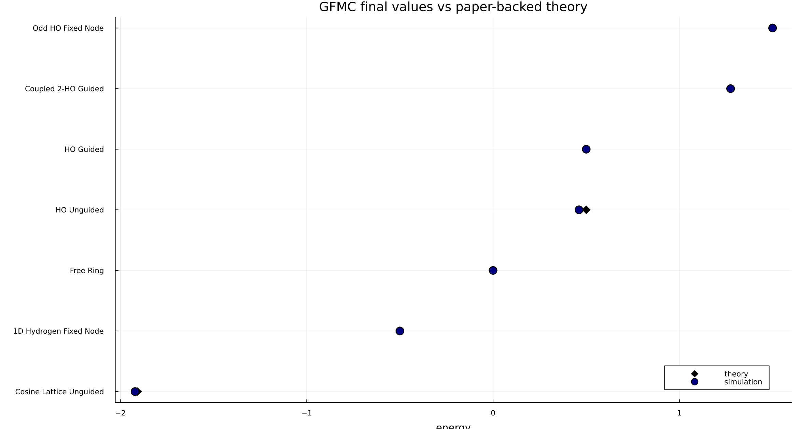

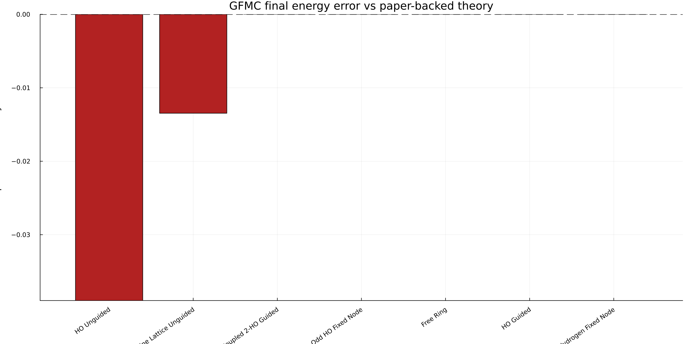

## Free Ring

- Tier: `final`
- Variant: `unguided`
- Theory/data pairing: the history figure overlays the GFMC energy trace with the paper-backed reference line and shows the simulation-minus-theory residual in the right panel.
- Density/data pairing: the density figure overlays the sampled final-density estimate with the benchmark's exact theory/reference curve for the cited model.
- Computed final value: `0.00000000 +/- 0.00e+00`
- Theory reference: `0.00000000`
- Final error: `0.000e+00`
- References: [Schrodinger 1926 (II)](https://doi.org/10.1002/andp.19263840602)

Inference from Schrodinger's rotor/free-wave exact theory: the periodic free-particle ground state is uniform with E0 = 0 in the repository units.

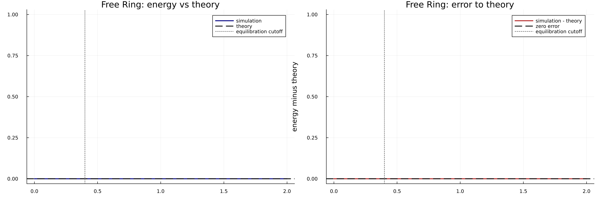

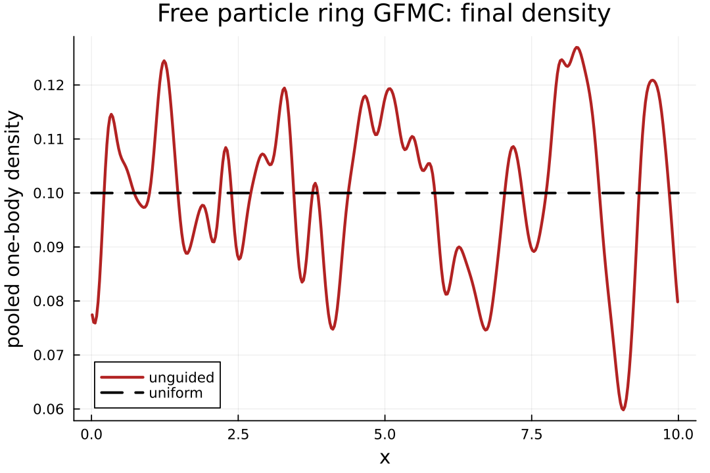

## HO Unguided

- Tier: `final`
- Variant: `unguided`
- Theory/data pairing: the history figure overlays the GFMC energy trace with the paper-backed reference line and shows the simulation-minus-theory residual in the right panel.
- Computed final value: `0.46103526 +/- 1.61e-03`
- Theory reference: `0.50000000`
- Final error: `-3.896e-02`
- References: [Schrodinger 1926 (II)](https://doi.org/10.1002/andp.19263840602)

Direct exact harmonic-oscillator ground-state reference E0 = omega / 2 with omega = 1.

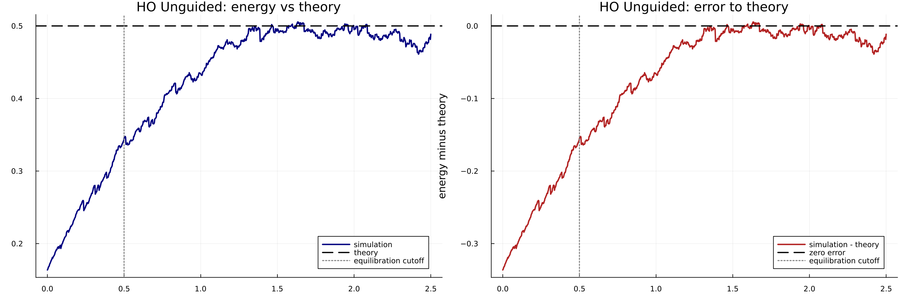

## HO Guided

- Tier: `final`
- Variant: `guided warm start`
- Theory/data pairing: the history figure overlays the GFMC energy trace with the paper-backed reference line and shows the simulation-minus-theory residual in the right panel.
- Computed final value: `0.50000000 +/- 0.00e+00`
- Theory reference: `0.50000000`
- Final error: `0.000e+00`
- References: [Schrodinger 1926 (II)](https://doi.org/10.1002/andp.19263840602)

Same exact harmonic-oscillator reference as the unguided case, but with the exact Gaussian trial state.

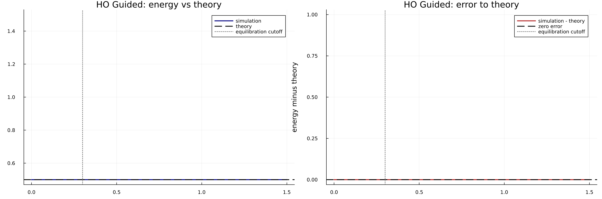

## Coupled 2-HO Guided

- Tier: `final`
- Variant: `guided warm start`
- Theory/data pairing: the history figure overlays the GFMC energy trace with the paper-backed reference line and shows the simulation-minus-theory residual in the right panel.
- Computed final value: `1.27459667 +/- 2.87e-17`
- Theory reference: `1.27459667`
- Final error: `-7.327e-15`
- References: [Vega et al. 2024](https://arxiv.org/abs/2410.00021)

Exact center-of-mass plus relative-mode energy for the benchmark parameters omega = 1 and kappa = 0.7.

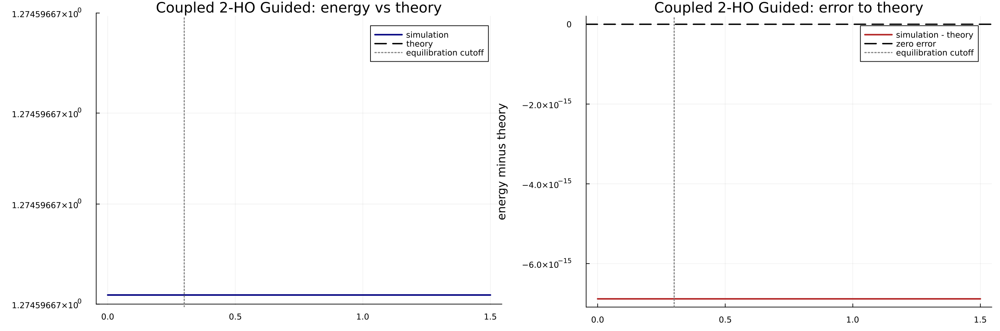

## Odd HO Fixed Node

- Tier: `final`
- Variant: `guided fixed node`
- Theory/data pairing: the history figure overlays the GFMC energy trace with the paper-backed reference line and shows the simulation-minus-theory residual in the right panel.
- Computed final value: `1.50000000 +/- 9.39e-16`
- Theory reference: `1.50000000`
- Final error: `-6.661e-16`
- References: [Schrodinger 1926 (II)](https://doi.org/10.1002/andp.19263840602)

Inference from the exact oscillator spectrum: the odd one-dimensional state has E = 3 omega / 2 for omega = 1.

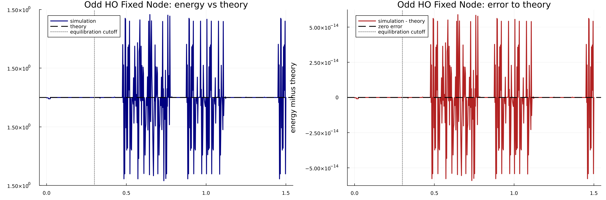

## 1D Hydrogen Fixed Node

- Tier: `final`
- Variant: `guided fixed node`
- Theory/data pairing: the history figure overlays the GFMC energy trace with the paper-backed reference line and shows the simulation-minus-theory residual in the right panel.
- Computed final value: `-0.50000000 +/- 3.81e-18`
- Theory reference: `-0.50000000`
- Final error: `0.000e+00`
- References: [Loudon 1959](https://doi.org/10.1119/1.1934950), [Palma and Raff 2006](https://doi.org/10.1139/P06-072)

The benchmark targets the odd-parity hydrogenic branch; the n = 1 odd state has E = -1/2 in the convention used here. This is an inference from the cited odd-state treatments.

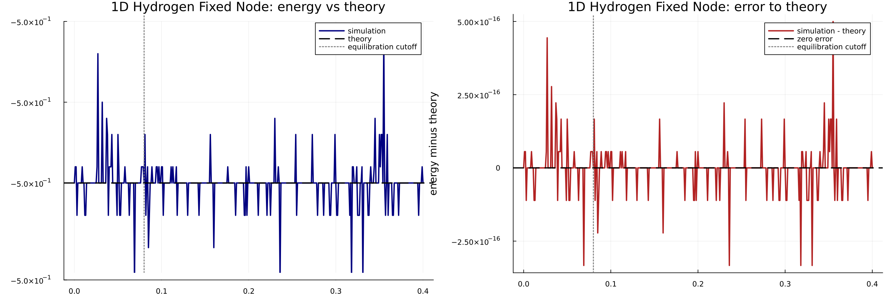

## 1D Hydrogen Unguided

- Tier: `final`
- Variant: `unguided singular`
- Theory/data pairing: the history figure overlays the GFMC energy trace with the paper-backed reference line and shows the simulation-minus-theory residual in the right panel.
- Computed final value: `-829.92957892 +/- 1.53e+02`
- Theory reference: `-0.50000000`
- Final error: `-8.294e+02`
- References: [Loudon 1959](https://doi.org/10.1119/1.1934950), [Palma and Raff 2006](https://doi.org/10.1139/P06-072)

Same odd-parity hydrogenic reference as the fixed-node case, used here only as a stress-path comparison because unguided propagation near the singular potential is intentionally unstable.

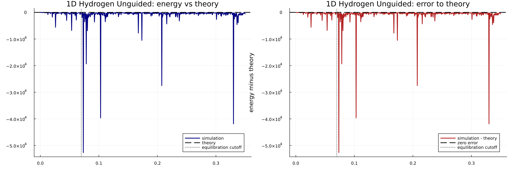

## Cosine Lattice Unguided

- Tier: `final`
- Variant: `unguided`
- Theory/data pairing: the history figure overlays the GFMC energy trace with the paper-backed reference line and shows the simulation-minus-theory residual in the right panel.
- Density/data pairing: the density figure overlays the sampled final-density estimate with the benchmark's exact theory/reference curve for the cited model.
- Computed final value: `-1.92148817 +/- 2.96e-03`
- Theory reference: `-1.90802366`
- Final error: `-1.346e-02`
- References: [Bloch 1929](https://doi.org/10.1007/BF01339455), [Slater 1937](https://doi.org/10.1103/PhysRev.51.846), [Yin and Erwin 2020](https://arxiv.org/abs/2003.06647)

Paper-backed exact theory: a one-dimensional sinusoidal potential maps to the periodic Mathieu/Bloch problem. The plotted reference value is the benchmark's numerical evaluation of that exact theory at the repo parameters.

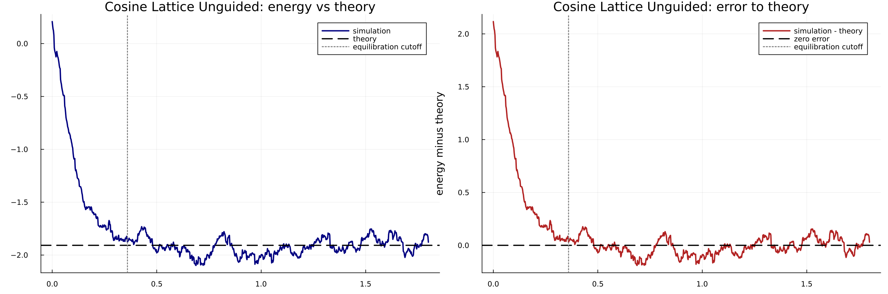

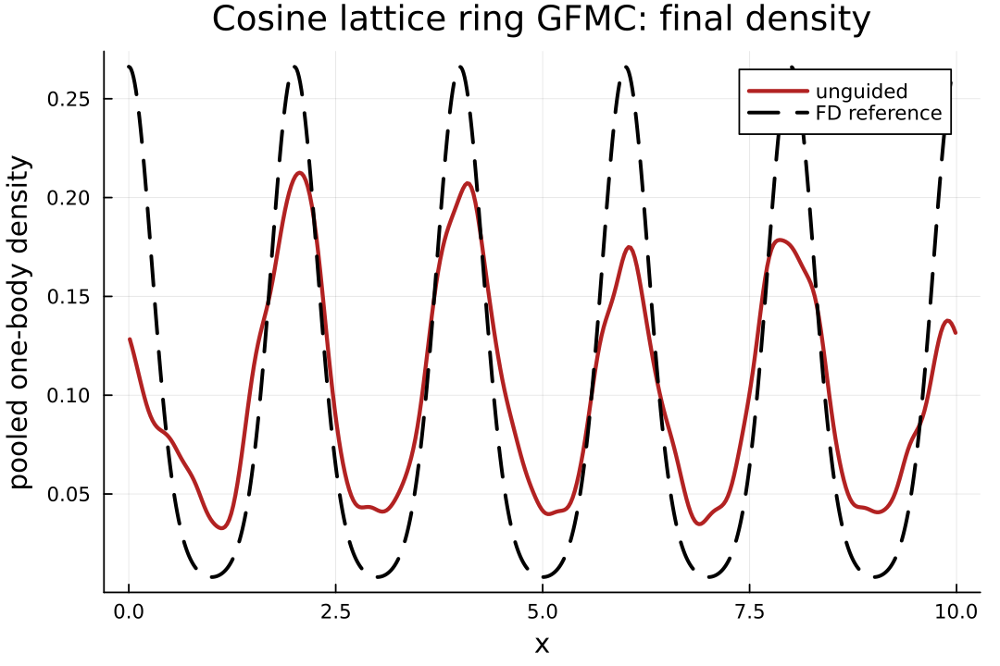

## Cosine Lattice Guided

- Tier: `sweep`
- Variant: `guided dt=0.0010`
- Theory/data pairing: the history figure overlays the GFMC energy trace with the paper-backed reference line and shows the simulation-minus-theory residual in the right panel.
- Density/data pairing: the density figure overlays the sampled final-density estimate with the benchmark's exact theory/reference curve for the cited model.
- Computed final value: `-2.62929557 +/- 4.36e-02`
- Theory reference: `-1.90802366`
- Final error: `-7.213e-01`
- References: [Bloch 1929](https://doi.org/10.1007/BF01339455), [Slater 1937](https://doi.org/10.1103/PhysRev.51.846), [Yin and Erwin 2020](https://arxiv.org/abs/2003.06647)

Same Mathieu/Bloch exact reference as the unguided cosine case, used here to stress-test the analytic guiding ansatz.

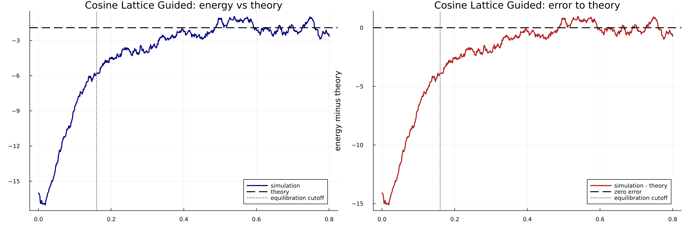

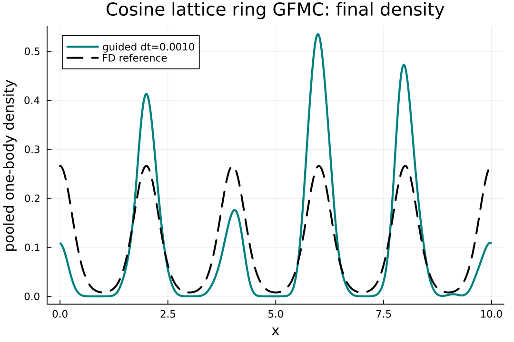

## Scope

- This page is intentionally limited to paper-backed cases. Repository-internal exact-reference benchmarks, such as the periodic-ion soft-Coulomb systems, are excluded here because they do not match a published parameter set one-to-one.
- The unguided hydrogen case remains in the gallery because it is a useful failure/stress comparison against the same odd-state hydrogen reference.
